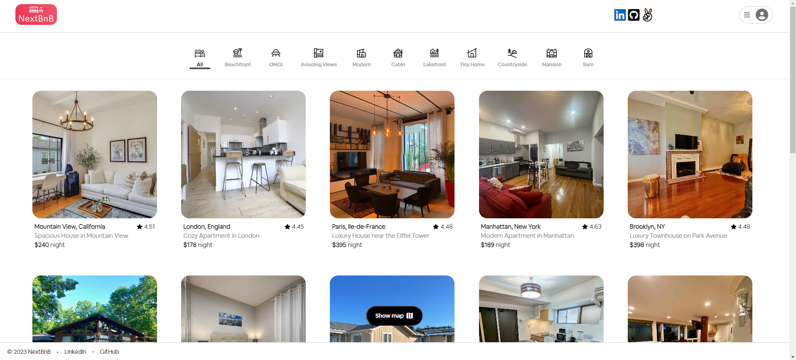
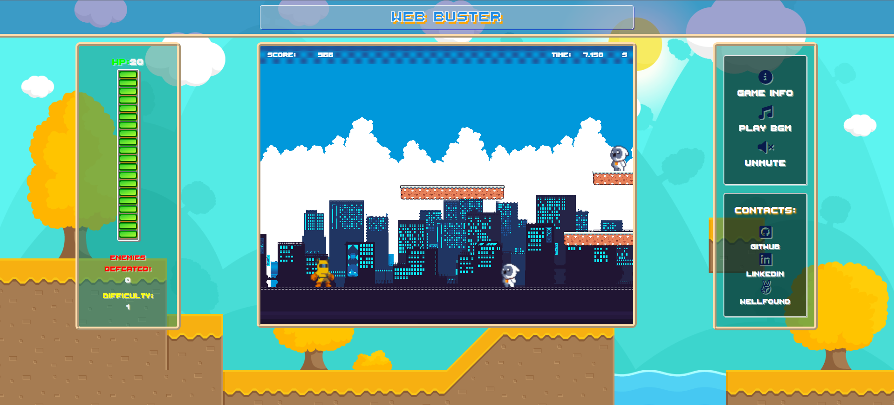
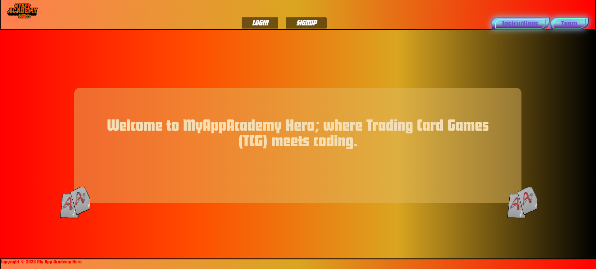

Hi My name is Jiamin Zou
==================================================================================================================================

Passionate full stack developer with a strong foundation in Applied Mathematics from New York City College of Technology. Transitioned from underpaying jobs to pursue a fulfilling career in programming. App Academy graduate with expertise in full stack development. Eager learner, constantly improving skills. Enthusiastic traveler and gamer. Sushi and ramen lover. Let's collaborate and create something awesome together! 🚀💻

* 🌍  I'm based in New York City
* 🤝  I'm open to collaborating on any interesting projects
* 📫 How to reach me ...
    * ✉️  You can contact me at [jiaminz622@gmail.com](mailto:jiaminz622@gmail.com)
    *  [GitHub](https://www.github.com/Jiamin-Zou)
    *  [LinkedIn](https://www.linkedin.com/in/jiaminzou95/)
    * <a href="https://wellfound.com/u/jiamin-zou-1" target="_blank" rel="noreferrer">✌️</a> [Wellfound](https://wellfound.com/u/jiamin-zou-1)
      
 

### Skills

 

### My GitHub Stats

 

### Projects
---

       

[Live Site](https://nextbnb.onrender.com/)

---

       

[Live Site](https://my-app-academy-heroes.onrender.com/)

---

       

[Live Site](https://jiamin-zou.github.io/web-buster/)

